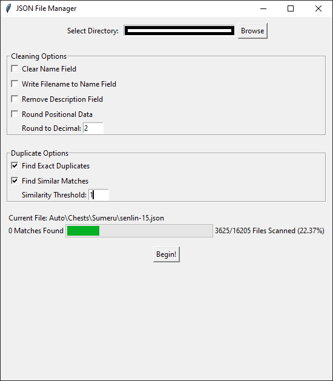
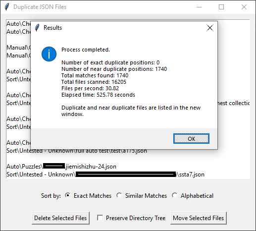

# JSON File Manager

The JSON File Manager is a Python GUI application for processing and managing JSON files. It provides functionality to clean JSON data and find exact and similar duplicate JSON files based on the 'position' field.

## Warning
This is still very much WIP, and as it has the capability to delete files so pleas proceed with caution

## Features

- Clean JSON data:
  - Clear the 'name' field
  - Write the filename to the 'name' field
  - Remove the 'description' field
- Find exact duplicate JSON files based on the 'position' field
  - Find similar duplicate JSON files within a specified tolerance
- Round position values to a specified decimal places
- Sort and delete duplicate/near-duplicate files
- Save results to a text file

## Usage

1. Clone the repository or download the script files.
2. Install the required dependencies (tkinter, NumPy).
3. Run the `gui.py` script to launch the JSON File Manager application.
4. Select the directory containing the JSON files you want to process.
5. Choose the desired cleaning and duplicate finding options.
6. Click the "Begin!" button to start processing the files.
7. Delete or move duplicate/near-duplicate files as needed.
8. Save the results to a text file if desired.

## Requirements

- Python 3.x
- tkinter
- NumPy

## KNOWN BUGS

- While scanning it will display "0 matches found" despite finding matches
- The sorting for the list of duplicate files seems to be bugged
  - (When clicking 'Sort By:' the list doesn't group the matches together)

## Future Plans

- Overhaul GUI
- Implement saving/loading results list
- Allow selection of multiple directories
- Display the position itself for each group
- Implement a form of auto-selection for the results
  - Ideally, a form of regex searching for the directory
  - Option to always ensure one of each matching file is preserved
- Optimize scanning (starts to slow down after 10K+ files)
- More customization (Instead of 'Clear Name Field' allow user to specify 'Clear x Field', etc)
- Pause/Stop/Resume functionality when scanning